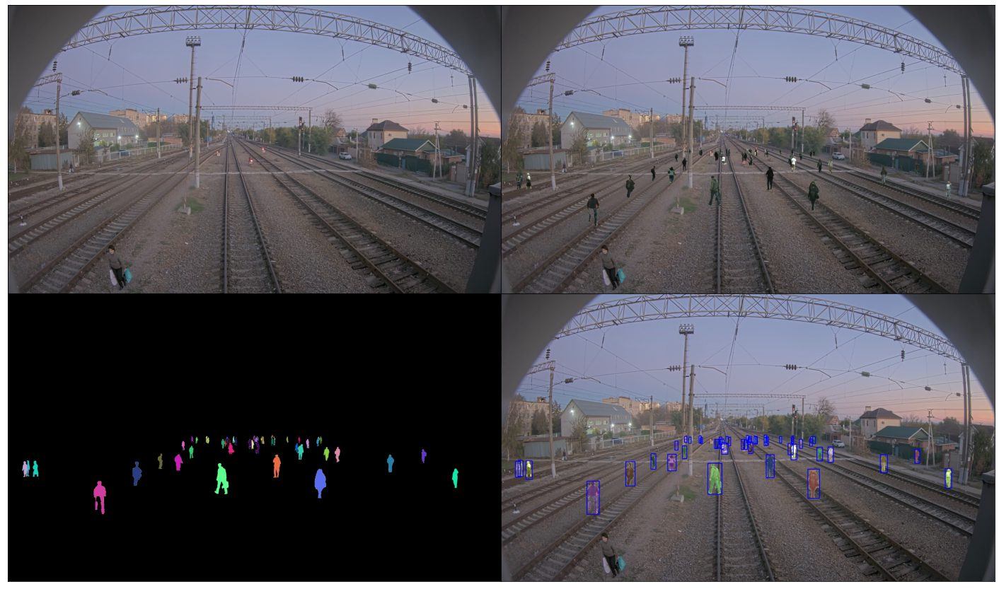

# "Cut and paste" augmentation

[](https://zenodo.org/badge/latestdoi/328174810)

Repository contains easy to use Python implementation of "Cut and paste" augmentation for object detection and instance and semantic segmentations. The main idea was taken from [Simple Copy-Paste is a Strong Data Augmentation Method for Instance Segmentation](https://arxiv.org/pdf/2012.07177v1.pdf) and supplemented by the ability to add objects in 3D in the camera coordinate system using a Bird's Eye View Transformation (BEV). Optional wrappers are available for [Albumentations](https://github.com/albumentations-team/albumentations) and Torchvision.

<figure>
  </img>
</figure>

## Installation

The package is published on PyPI:

```bash
pip install cap-augmentation
```

Optional integrations are installed as extras:

```bash
pip install "cap-augmentation[albumentations]"   # CapAlbumentations wrapper
pip install "cap-augmentation[torchvision]"      # CapTorchvision wrapper
pip install "cap-augmentation[histogram]"        # histogram_matching=True support
pip install "cap-augmentation[viz]"              # visualization helpers (matplotlib)
pip install "cap-augmentation[dataset]"          # dependencies for dataset_tools/ scripts
```

To install several extras at once:

```bash
pip install "cap-augmentation[albumentations,torchvision,histogram,viz]"
```

### From source (for development)

Clone the repository and install in editable mode with the test extras:

```bash
git clone https://github.com/RocketFlash/cap-augmentation.git
cd cap-augmentation
pip install -e ".[test,torchvision]"
pytest
```

## Public API

```python
from cap_augmentation import (
    CapAug,              # core cut-and-paste augmenter
    CapAugMulticlass,    # combine per-class CapAug instances
    CapAlbumentations,   # Albumentations DualTransform wrapper
    CapTorchvision,      # torchvision v2-style wrapper
    ImageMaskTransform,  # adapter for per-object (image, mask) callables
    resize_keep_ar,      # aspect-ratio-preserving resize helper
)
```

The wrapper classes require their respective extras (`albumentations`,
`torchvision`).

## Example of usage

All examples are shown in [examples/notebooks/bev_and_pedestrians_demo.ipynb](https://github.com/RocketFlash/cap-augmentation/blob/main/examples/notebooks/bev_and_pedestrians_demo.ipynb)
(BEV / pixel coordinates / multi-class).


[](https://colab.research.google.com/drive/1Rmln475YERs5ZIp3_jDKTV8JEfk_qDdy?usp=sharing)

### Usage in pixel coordinates

```python
from pathlib import Path

import cv2

from cap_augmentation import CapAug

# Any list of PNG paths with an alpha channel works as a source.
# Typical workflow: generate cutouts with dataset_tools/cityscapes/
# (see "Data preparation" below) and glob them:
#
#     SOURCE_IMAGES = sorted(Path("data/human_dataset_filtered").glob("*.png"))
SOURCE_IMAGES = ["path/to/source1.png", "path/to/source2.png"]

image = cv2.imread("path/to/the/destination/image")

cap_aug = CapAug(
    SOURCE_IMAGES,
    n_objects_range=[10, 20],
    h_range=[80, 120],
    x_range=[500, 1500],
    y_range=[600, 1000],
    coords_format="xyxy",  # "xyxy" | "xywh" | "yolo"
)
result_image, bboxes, semantic_mask, instance_mask = cap_aug(image)
```

### Usage in camera coordinate system (all values are in meters)

When `bev_transform` is set, `x_range`, `y_range`, `z_range`, and `h_range`
are interpreted in **meters** relative to the camera. The package projects
each object to its pixel location and scales it by perspective using the
provided calibration.

```python
import cv2

from cap_augmentation import CapAug
from cap_augmentation.bev import BEV

SOURCE_IMAGES = ["path/to/source1.png", "path/to/source2.png"]

image = cv2.imread("path/to/the/destination/image")

# Extrinsic camera parameters (camera pose relative to the ground frame).
camera_info = {
    "pitch": -2,
    "yaw": 0,
    "roll": 0,
    "tx": 0,
    "ty": 5,
    "tz": 0,
    "output_w": 1000,  # BEV (top-down) output canvas
    "output_h": 1000,
}
# Path to intrinsic camera parameters YAML. If None, the packaged default
# (src/cap_augmentation/bev/default_calibration.yaml) is used. That default
# corresponds to a 1920x1080 AXIS surveillance camera (~46° horizontal FOV)
# — it is a placeholder. Pass your own ROS-style camera_info YAML when
# working with a different camera; mismatched intrinsics will shift the
# BEV projection and skew the meters→pixels conversion.
calib_yaml_path = None

bev_transform = BEV(
    camera_info=camera_info,
    calib_yaml_path=calib_yaml_path,
)

cap_aug = CapAug(
    SOURCE_IMAGES,
    bev_transform=bev_transform,
    n_objects_range=[30, 50],
    h_range=[2.0, 2.5],     # object heights in meters
    x_range=[-25, 25],      # left/right of camera axis, meters
    y_range=[0, 100],       # distance from camera, meters
    z_range=[0, 2],         # vertical offset, meters
    coords_format="yolo",   # "xyxy" | "xywh" | "yolo"
)
result_image, bboxes, semantic_mask, instance_mask = cap_aug(image)
```

### Multi-class usage

`CapAugMulticlass` runs several `CapAug` instances (one per class) and merges
their boxes/masks, tagging each generated box with its class id (appended as
the fifth column of the output box array).

```python
from cap_augmentation import CapAug, CapAugMulticlass

cap_augs = [
    CapAug(
        PEDESTRIAN_IMAGES,
        n_objects_range=[5, 10],
        h_range=[80, 120],
        x_range=[0, 1920],
        y_range=[400, 1000],
    ),
    CapAug(
        CAR_IMAGES,
        n_objects_range=[2, 5],
        h_range=[60, 100],
        x_range=[0, 1920],
        y_range=[400, 1000],
    ),
]
cap_multiclass = CapAugMulticlass(
    cap_augs=cap_augs,
    probabilities=[1.0, 0.7],
    class_idxs=[1, 2],
)
result_image, boxes_with_class, semantic_mask, instance_masks = cap_multiclass(image)
```

### Usage with albumentations

Install the optional Albumentations integration first:

```bash
pip install "cap-augmentation[albumentations]"
```

```python
import albumentations as A

from cap_augmentation import CapAlbumentations

transform = A.Compose(
    [
        CapAlbumentations(
            p=1.0,
            source_images=SOURCE_IMAGES,
            n_objects_range=[10, 20],
            h_range=[80, 120],
            x_range=[500, 1500],
            y_range=[600, 1000],
            class_idx=1,
        ),
        A.HorizontalFlip(p=0.5),
        A.RandomBrightnessContrast(p=0.2),
        A.RandomRain(p=1.0, blur_value=3),
    ],
    bbox_params=A.BboxParams(format="pascal_voc"),
)
```

Do not share one `CapAlbumentations` instance across concurrent threads;
Albumentations calls image, mask, and bounding-box hooks sequentially on the
same transform object.

### Usage with torchvision

The Torchvision integration follows the detection target style used by
`torchvision.transforms.v2`: images can be tensors, `tv_tensors.Image`, PIL
images, or numpy arrays, and targets are dictionaries with `boxes`, `labels`,
and optionally `masks`.

```python
from cap_augmentation import CapTorchvision

transform = CapTorchvision(
    source_images=SOURCE_IMAGES,
    n_objects_range=[10, 20],
    h_range=[100, 101],
    x_range=[500, 1500],
    y_range=[600, 1000],
    class_idx=1,
)

image, target = transform(image, target)
```

### Reproducibility

Pass an integer seed (or a `numpy.random.Generator`) via `rng=` to make a
`CapAug` instance deterministic without seeding global state. Two
instances built with the same seed produce bit-identical images, boxes,
and masks:

```python
from cap_augmentation import CapAug

aug = CapAug(SOURCE_IMAGES, rng=42)
```

If you leave `rng` unset, `CapAug` falls back to the stdlib `random`
module and `np.random` — seed both for global reproducibility.

### Source image cache

Decoded source PNGs are cached in memory by default (one entry per
unique source path). For training loops with `n_objects_range=(10, 20)`
this avoids decoding the same PNG dozens of times per augmented image.
Pass `cache_size=N` to cap the cache, or `cache_size=0` to disable it
(useful when source files are rewritten between calls).

### Object opacity / blending

By default, `CapAug` alpha-composites each pasted object using the alpha
channel of its source PNG: hard-edged masks produce crisp paste boxes,
anti-aliased masks blend smoothly into the destination.

`blending_coeff` adds an optional "ghost" effect: values in `(0, 1)`
blend the source colors with the destination colors at the given source
weight before the alpha composite, so `blending_coeff=0.5` produces a
translucent paste. The default `0` (no ghost) is the most common
setting. Source PNGs missing a transparency channel trigger an
`OpaqueSourceWarning` because the pasted "object" then covers the full
source rectangle — usually a bug in the source list.

### Object-level transforms

`CapAug` can also transform each pasted object before it is inserted into the
destination. New code should use the library-neutral `object_transforms`
argument; the older `albu_transforms` parameter is kept as a deprecated alias
and still accepts Albumentations callables.

`histogram_matching=True` additionally requires the `histogram` extra.

```python
from cap_augmentation import CapAug, ImageMaskTransform


def object_transform(image, mask):
    # ... transform the per-object RGB image and its alpha mask ...
    return image, mask


cap_aug = CapAug(
    SOURCE_IMAGES,
    object_transforms=ImageMaskTransform(object_transform),
)
```

## Data preparation

Any PNG image with transparency is suitable as a source: the alpha channel
defines the visible region, and bounding boxes are computed from it. You can
generate such cutouts yourself from instance segmentation datasets. An
example for Cityscapes / CityPersons is below.

The `dataset_tools/` scripts are repository tools, **not** part of the
installed Python package. Clone the repository and install the `dataset`
extra to use them:

```bash
git clone https://github.com/RocketFlash/cap-augmentation.git
cd cap-augmentation
pip install -e ".[dataset]"
```

### Generate pedestrians dataset from Cityscapes and CityPersons

Put [Cityscapes](https://www.cityscapes-dataset.com/) and
[CityPersons](https://github.com/cvgroup-njust/CityPersons) into `./data/`.
Edit `dataset_tools/cityscapes/config.py` if needed, then run:

```bash
./dataset_tools/cityscapes/run.sh
```

This produces the filtered cutouts in `data/human_dataset_filtered/` (or the
path set in the config file).

You can also run the two steps manually. First, cut PNGs of people out of
Cityscapes images using their instance masks:

```bash
python dataset_tools/cityscapes/generate_dataset.py
```

Then filter out cutouts that are too small or too cropped (only a small part
of the body visible):

```bash
python dataset_tools/cityscapes/filter_dataset.py
```

The result is available in `./data/human_dataset_filtered/` and can be passed
directly to `CapAug(source_images=...)`.
